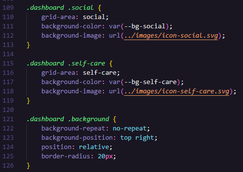
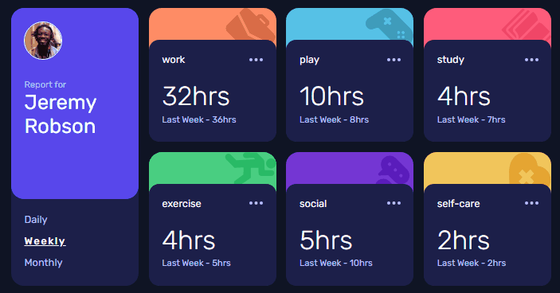

# Time tracking dashboard


## O desafio

Consiste em criar um dashboard, com informações de tempo em 3 formatos: `Daily`, `Weekly` e `Monthly`.

Utilizei o *grid template areas* do `display: grid;`

### Tecnologias necessárias

- HTML
- CSS
- Javascript

### Dificuldades


Os elementos em destaque, foram feitos de forma similares: na `div pai`, foi inserido o `display: relative` e na `div filha`, foi inserido `position: absolute`. Depois disso, só posicionei. 

No segundo elemento circulado em vermelho, nos *backgrounds coloridos*, inseri 2 classes. Em uma, foi inserido a cor e a imagem, e na outra, foi inserida as propriedades do background. Veja abaixo:



Na parte do JS, inseri todas as informações separando em divs e fui alternando com JS.

```
<div class="time">
                    <h1 class="hours h-daily esconder">0</h1>
                    <h1 class="hours h-weekly mostrar">2</h1>
                    <h1 class="hours h-monthly esconder">7</h1>

                    <span class="p-daily esconder">Last Week - 1hrs</span>
                    <span class="p-weekly mostrar">Last Week - 2hrs</span>
                    <span class="p-monthly esconder">Last Week - 11hrs</span>
                </div>
```


## Demonstração do projeto

