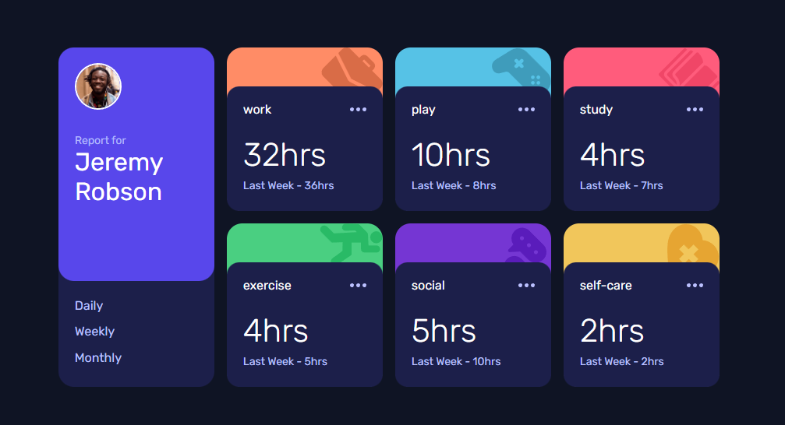
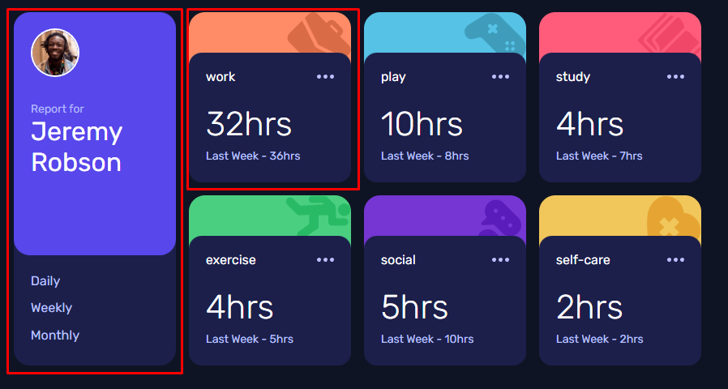
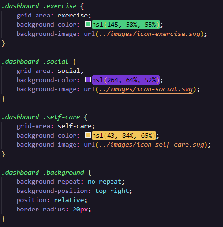

# Time tracking dashboard

## O desafio

Consiste em criar um dashboard, com informações de tempo em 3 formatos: `Daily`, `Weekly` e `Monthly`.

Utilizei o *grid template areas* do `display: grid;`

### Tecnologias necessárias

- HTML
- CSS
- Javascript - *ainda não iniciado módulo de JS*

### Dificuldades

Os elementos em destaque, foram feitos de forma similares: na `div pai`, foi inserido o `display: relative` e na `div filha`, foi inserido `position: absolute`. Depois disso, só posicionei. 

No segundo elemento circulado em vermelho, nos *backgrounds coloridos*, inseri 2 classes. Em uma, foi inserido a cor e a imagem, e na outra, foi inserida as propriedades do background. Veja abaixo:

